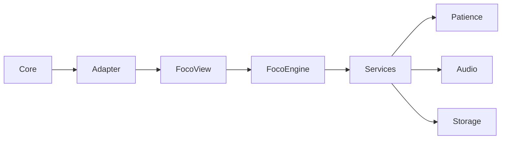
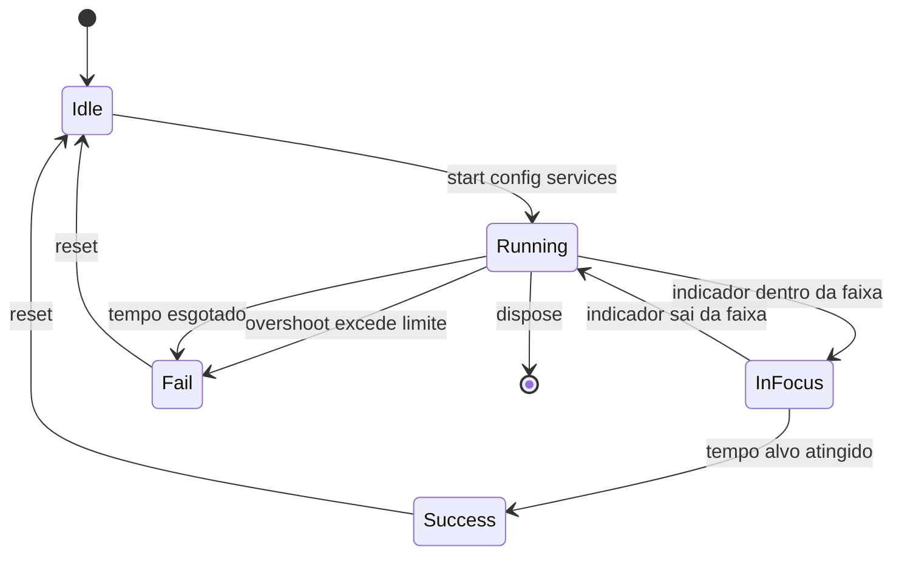

# Design Document — Foco Milimétrico

## Overview

**Purpose**: O Foco Milimétrico entrega ao jogador um desafio curto de precisão: mover um indicador contínuo até uma faixa de foco estreita e mantê-lo lá pelo tempo exigido, sem ultrapassar o limite de overshoot.

**Users**: O jogador usa o minigame dentro do core loop ("Modo Conserto"); o dono do core o integra pelo contrato comum sem conhecer sua lógica interna.

**Impact**: Adiciona um módulo de minigame autocontido que roda isoladamente com serviços fake e, na integração, emite deltas de paciência e um resultado padronizado ao core.

### Goals
- Implementar a mecânica de controle, faixa de foco, overshoot e falha de forma testável isoladamente.
- Respeitar o contrato comum (`start`, `complete`, `fail`, `reset`, `dispose`).
- Parametrizar a dificuldade por `config`, com valores padrão documentados.
- Atender aos requisitos de acessibilidade do minigame (multicanal, teclado, redução de movimento).

### Non-Goals
- Não implementa o medidor de Paciência da Turma (apenas emite deltas por serviço).
- Não implementa navegação do core loop nem os outros minigames.
- Não acessa `localStorage` diretamente (usa o adapter de persistência recebido).

## Boundary Commitments

### This Spec Owns
- Estado interno do minigame Foco (posição do indicador, tempo em foco, penalidade acumulada, tempo restante).
- Detecção de sucesso, overshoot e falha.
- Feedback visual e tátil do próprio minigame.
- Leitura e validação dos parâmetros de dificuldade em `config`.

### Out of Boundary
- Lógica e estado do medidor de Paciência (consumido via `services.patience.applyDelta`).
- Persistência real (consumida via `services.storage`).
- Áudio real (consumido via `services.audio`).
- Ciclo do core loop e transições entre telas.

### Allowed Dependencies
- Contrato comum dos minigames (assinaturas `start/complete/fail/reset/dispose`).
- `services` fornecidos em `start`: `patience`, `audio`, `storage` (usados atrás de fake adapters até a integração).
- React 19 (Create React App) — camada de UI.

### Revalidation Triggers
- Mudança na forma do contrato comum ou no payload de `result`.
- Mudança na interface dos `services` (patience/audio/storage).
- Mudança na direção de dependência (ex.: minigame passar a acessar estado global direto).

## Architecture

### Architecture Pattern & Boundary Map

Padrão: **hook de lógica isolado + componente de apresentação**. A lógica do minigame vive num hook puro (`useFocoEngine`), sem acoplar-se ao DOM; o componente React apenas renderiza estado e encaminha entradas. Os `services` entram por injeção via props/`start`, permitindo fakes nos testes e no harness isolado.



**Architecture Integration**:
- Selected pattern: lógica em hook + view de apresentação (separa regra de render).
- Domain/feature boundaries: `FocoEngine` (regras) x `FocoView` (render) x `Adapter` (contrato comum).
- Dependency direction: `Types → Config → Engine → View → Adapter`. Cada camada só importa das anteriores; nunca para cima.
- New components rationale: o adapter isola o contrato comum; o engine permite testar a regra sem render.

### Technology Stack

| Layer | Choice / Version | Role in Feature | Notes |
|-------|------------------|-----------------|-------|
| Frontend / UI | React 19.3 (CRA) | Renderização do minigame e captura de entrada | Sem TypeScript; JS + JSDoc |
| Runtime | Node.js (react-scripts) | Build e testes | Sem ejeção |
| Data / Storage | Adapter injetado (`services.storage`) | Melhor pontuação e config persistida | Fake nos testes |
| Messaging / Events | `services.patience.applyDelta` | Emissão de deltas de paciência | Contrato comum |

## File Structure Plan

### Directory Structure
```
src/
├── minigames/
│   └── foco/
│       ├── focoConfig.js       # Defaults e validação de config (Requirement 6)
│       ├── focoEngine.js       # Regra pura do minigame (Requirements 2,3,4)
│       ├── useFocoEngine.js    # Hook React que roda o engine no tempo (loop/timer)
│       ├── FocoMilimetrico.js  # Componente de apresentação + entrada (Requirements 2,5,7)
│       ├── FocoMilimetrico.css # Estilos e estados visuais (Requirement 5,7)
│       └── focoContract.js     # Adapter start/complete/fail/reset/dispose (Requirement 1)
└── minigames/
    └── fakes/
        └── fakeServices.js     # patience/audio/storage fake para harness e testes
```

> `minigames/fakes/fakeServices.js` existe para permitir execução e teste isolados antes dos adapters reais (não é código de produção final).

## System Flows

Ciclo de vida e estado do minigame:



Decisões de fluxo: a contagem de permanência só acumula no estado `InFocus`; sair da faixa zera a contagem corrente (Requirement 3.3). Overshoot aplica penalidade e emite delta negativo de paciência (Requirements 4.1, 4.3).

## Requirements Traceability

| Requirement | Summary | Components | Interfaces | Flows |
|-------------|---------|------------|------------|-------|
| 1.1–1.5 | Ciclo de vida pelo contrato | focoContract | start/complete/fail/reset/dispose | State diagram |
| 2.1–2.4 | Controle do indicador | focoEngine, FocoMilimetrico | move(delta) | State diagram |
| 3.1–3.4 | Faixa de foco e sucesso | focoEngine | tick(dt) | State diagram |
| 4.1–4.4 | Overshoot e falha | focoEngine | tick(dt), move(delta) | State diagram |
| 5.1–5.4 | Feedback visual e tátil | FocoMilimetrico, FocoMilimetrico.css | services.audio, vibrate | — |
| 6.1–6.3 | Config de dificuldade | focoConfig | validateConfig(config) | — |
| 7.1–7.4 | Acessibilidade | FocoMilimetrico | ARIA, teclado, prefers-reduced-motion | — |

## Components and Interfaces

| Component | Domain/Layer | Intent | Req Coverage | Key Dependencies (P0/P1) | Contracts |
|-----------|--------------|--------|--------------|--------------------------|-----------|
| focoConfig | Config | Defaults e validação de parâmetros | 6.1–6.3 | — | State |
| focoEngine | Domain/Logic | Regra pura: mover, focar, overshoot, falha | 2,3,4 | focoConfig (P0) | Service, State |
| useFocoEngine | UI/Logic | Roda o engine no tempo (loop) e expõe estado | 2,3,4 | focoEngine (P0) | State |
| FocoMilimetrico | UI | Render, entrada, feedback, acessibilidade | 2,5,7 | useFocoEngine (P0), services (P0) | State |
| focoContract | Integration | Adapter do contrato comum | 1 | focoEngine (P0), services (P1) | Service, Event |

### Domain / Logic

#### focoEngine

| Field | Detail |
|-------|--------|
| Intent | Regra pura do minigame, sem React nem DOM |
| Requirements | 2.1–2.4, 3.1–3.4, 4.1–4.4 |

**Responsibilities & Constraints**
- Mantém o estado interno: `position`, `timeInFocus`, `penalty`, `timeRemaining`, `status`.
- É pura e determinística: dada a mesma sequência de `move`/`tick`, produz o mesmo resultado (testável sem render).
- Não conhece `services` nem React.

**Dependencies**
- Inbound: useFocoEngine — chama `move`/`tick` (P0)
- Outbound: focoConfig — lê parâmetros validados (P0)

**Contracts**: Service [x] / State [x]

##### Service Interface
```javascript
/**
 * @typedef {'idle'|'running'|'success'|'fail'} FocoStatus
 * @typedef {Object} FocoState
 * @property {number} position       // posição atual do indicador (min..max)
 * @property {number} timeInFocus     // tempo acumulado dentro da faixa (ms)
 * @property {number} penalty         // penalidade acumulada por overshoot
 * @property {number} timeRemaining   // tempo restante da rodada (ms)
 * @property {FocoStatus} status
 * @property {boolean} inFocus        // indicador dentro da faixa neste instante
 */

// createFocoEngine(config) -> engine
//   engine.getState() : FocoState
//   engine.move(delta:number) : void        // Requirement 2.2, 2.4, 4.1
//   engine.tick(dtMs:number) : FocoEvent[]   // Requirement 3.1-3.2, 4.2, 4.4
//   engine.reset() : void                    // Requirement 1.4

/**
 * @typedef {Object} FocoEvent
 * @property {'focus'|'overshoot'|'success'|'fail'} type
 * @property {string=} reason        // presente quando type === 'fail'
 * @property {number=} patienceDelta // delta a aplicar (negativo em overshoot)
 */
```
- Preconditions: `config` já validado por `focoConfig`.
- Postconditions: `tick` retorna a lista de eventos ocorridos naquele passo (foco, overshoot, sucesso, falha).
- Invariants: `position` sempre em `[min, max]`; `timeInFocus` só cresce no estado `inFocus`.

##### State Management
- State model: `FocoState` acima; transições conforme o state diagram.
- Persistence: nenhuma no engine (persistência é responsabilidade do adapter/serviço).
- Concurrency: single-threaded; `tick` avança o tempo em passos discretos.

### Integration

#### focoContract

| Field | Detail |
|-------|--------|
| Intent | Traduz o ciclo de vida do minigame para o contrato comum |
| Requirements | 1.1–1.5 |

**Responsibilities & Constraints**
- `start(config, services)`: valida config, cria o engine, guarda `services`, inicia o loop.
- `complete(result)` / `fail(reason)`: chama os callbacks recebidos do core.
- `reset()`: limpa só o estado interno. `dispose()`: remove timers/listeners.

**Contracts**: Service [x] / Event [x]

##### Service Interface
```javascript
/**
 * @typedef {Object} FocoServices
 * @property {{applyDelta:(n:number)=>void}} patience
 * @property {{play:(id:string)=>void, vibrate:(ms:number)=>void}} audio
 * @property {{get:(k:string)=>unknown, set:(k:string,v:unknown)=>void}} storage
 * @typedef {Object} FocoResult
 * @property {number} score
 * @property {number} timeUsedMs
 * @property {number} patienceDelta
 */

// createFocoContract({ onComplete, onFail })
//   start(config: object, services: FocoServices) : void
//   reset() : void
//   dispose() : void
```
- Preconditions: `services` implementam patience/audio/storage (fake ou real).
- Postconditions: no sucesso chama `onComplete(result)`; na falha `onFail(reason)`.

##### Event Contract
- Published: `patience.applyDelta(n)` em overshoot (negativo) e possivelmente no sucesso.
- Subscribed: nenhum (o minigame não escuta eventos globais).

### UI

#### FocoMilimetrico (+ useFocoEngine)

Componente de apresentação. Renderiza a faixa, o indicador e o feedback; captura entrada de teclado e ponteiro; expõe estado acessível.

**Implementation Notes**
- Integration: recebe `config`, `services` e callbacks por props; usa `useFocoEngine` para rodar o loop com `requestAnimationFrame`/timer.
- Validation: entrada de teclado (setas) além de ponteiro (Requirement 7.3); estado de foco indicado por cor + texto/ícone (Requirement 7.1).
- Risks: loop de tempo em teste — o engine é testado sem render; a view é testada com timers fake.

## Error Handling

### Error Strategy
- **Fail fast na config**: `validateConfig` recusa parâmetros inválidos e reporta qual (Requirement 6.3); o adapter não inicia o engine nesse caso.
- **Falha de jogo** (não é erro de sistema): overshoot/tempo esgotado → `fail(reason)` com motivo padronizado (`'overshoot'`, `'timeout'`).

### Error Categories and Responses
- User/config errors: config inválida → recusa inicialização com nome do parâmetro.
- Business logic: overshoot excede limite / tempo esgota → `fail(reason)`.

## Testing Strategy

### Unit Tests (focoEngine — sem render)
- `move` respeita limites min/max (2.4).
- `tick` acumula tempo em foco e emite `success` ao atingir o alvo (3.1, 3.2).
- Sair da faixa interrompe a contagem (3.3).
- Overshoot aplica penalidade e emite `overshoot` com `patienceDelta` negativo (4.1, 4.3).
- `fail` por penalidade no limite e por tempo esgotado (4.2, 4.4).

### Config Tests (focoConfig)
- Defaults aplicados quando parâmetro ausente (6.2).
- Config inválida é recusada com o parâmetro reportado (6.3).

### Integration Tests (focoContract com fakeServices)
- `start` inicializa e o sucesso chama `onComplete` com `result` (1.1, 1.2).
- Falha chama `onFail(reason)` (1.3).
- `reset` limpa só o estado interno; `dispose` remove timers (1.4, 1.5).

### UI Tests (FocoMilimetrico)
- Controle por teclado move o indicador (7.3).
- Estado de foco indicado por mais de um canal (7.1).
- Feedback de sucesso/falha renderizado (5.4).
