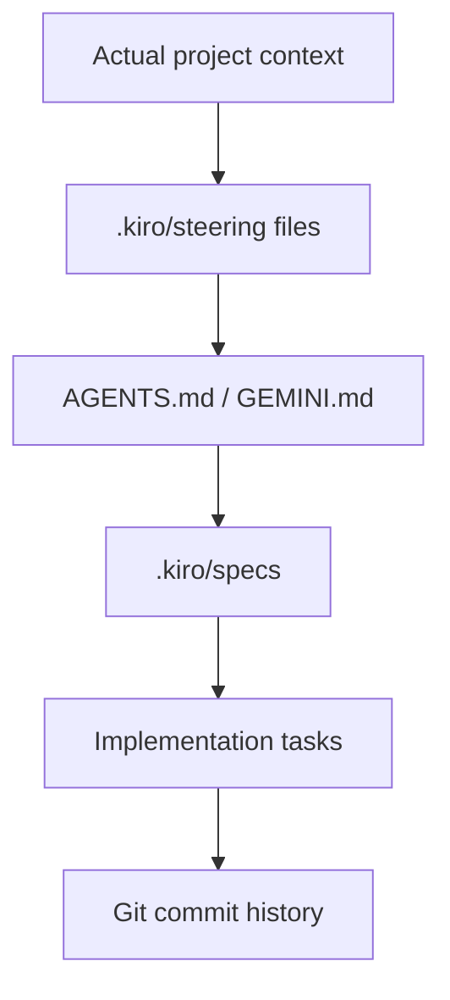
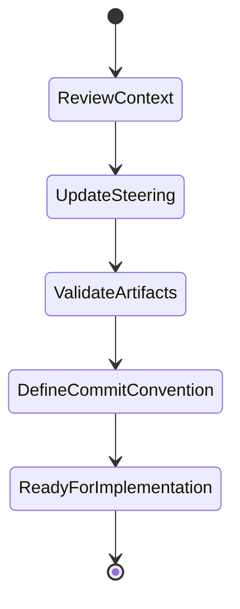

# Design Document

## Overview
This feature focuses on the project memory layer used by the cc-sdd workflow. The goal is to keep the repository aligned with the actual game project, preserve clear task traceability, and standardize the commit conventions used when implementing spec-driven work. The design intentionally keeps the scope narrow: project context, steering review, and commit discipline.

### Goals
- Align AI guidance with the actual game concept and stack.
- Keep `.kiro/steering` and `.kiro/specs` consistent and reviewable.
- Define a lightweight commit convention that links history to tasks.

### Non-Goals
- Rewriting the whole application architecture.
- Creating a separate backend or database.
- Generating all project tasks for other team members in this spec.

## Boundary Commitments

### This Spec Owns
- The project memory files under `.kiro/steering`.
- The spec structure for the Nathan AI/steering work.
- The repository-level commit message convention and traceability notes.

### Out of Boundary
- Gameplay rules and minigame logic outside the AI/steering scope.
- Generic infrastructure improvements unrelated to this workflow.

### Allowed Dependencies
- Existing project files: AGENTS.md, GEMINI.md, `.kiro/steering/*.md`, and the active `.kiro/specs` directories.
- Git history and branch naming conventions already present in the repository.

### Revalidation Triggers
- New tasks added to the project requiring new project memory guidance.
- Changes to the repository structure or tooling that affect the AI context.
- New commit style requirements introduced by the course or the team.

## Architecture
The design relies on a lightweight document-based model. Instead of a database or code service, the repository stores the project context in markdown files and spec folders. This mirrors the cc-sdd pattern and makes the artifacts clear to both contributors and AI systems.



### Technology Stack
| Layer | Choice / Version | Role in Feature | Notes |
|-------|------------------|-----------------|-------|
| Project memory | Markdown files | Context and agent guidance | Human- and AI-readable |
| Workflow | cc-sdd | Task lifecycle | Requirements, design, tasks |
| Version tracking | Git | Evidence trail | Commits map to work |

## File Structure Plan
```text
.kiro/
├── steering/
│   ├── product.md
│   ├── tech.md
│   └── structure.md
├── specs/
│   └── ia-steering/
│       ├── spec.json
│       ├── requirements.md
│       ├── design.md
│       └── tasks.md
└── settings/
    └── templates/
```

### Modified Files
- `vibeCodingDoDaniel/.kiro/steering/product.md` — ensure the game concept and value proposition stay aligned with the project.
- `vibeCodingDoDaniel/.kiro/steering/tech.md` — confirm the implementation stack is accurate for the project.
- `vibeCodingDoDaniel/.kiro/steering/structure.md` — keep the project layout conventions aligned with the app structure.
- `vibeCodingDoDaniel/AGENTS.md` — keep the workflow instructions consistent with the spec-driven process.

## System Flows


## Components and Interfaces

### Steering Review
| Field | Detail |
|-------|--------|
| Intent | Verify and update the AI project memory |
| Requirements | 1, 2, 4 |
| Owner / Reviewers | Nathan Fuchida |

**Responsibilities & Constraints**
- Confirm the files match the actual game concept and stack.
- Keep project memory readable and complete.

### Commit Convention
| Field | Detail |
|-------|--------|
| Intent | Standardize task-linked Git history |
| Requirements | 3 |
| Owner / Reviewers | Nathan Fuchida |

**Responsibilities & Constraints**
- Use prefixes or short messages that identify the feature or task.
- Keep each commit tied to a concrete change or artifact.

## Data Models
No database model is required. The main structured information is the task and spec metadata.

```ts
interface SteeringTaskStatus {
  id: string;
  name: string;
  status: 'pending' | 'in_progress' | 'done';
  linkedSpec?: string;
}
```

This is sufficient to track the review and implementation status without adding unnecessary project complexity.
