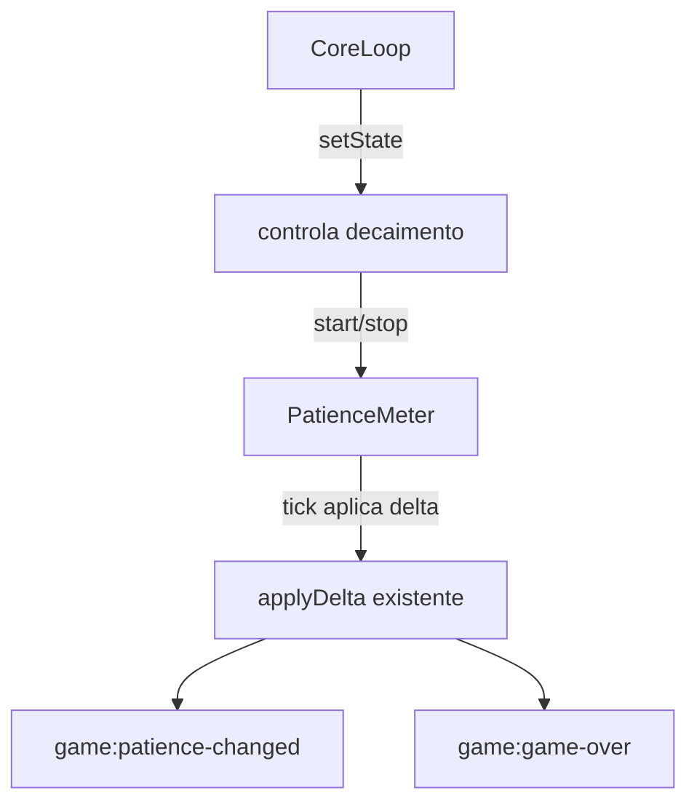

# Design Document — Paciência por tempo e design Apple

## Overview

**Purpose**: adicionar pressão de tempo ao medidor de Paciência e unificar o visual do jogo sob um design Apple-like.

**Users**: o jogador de "Consertando o Projetor"; os integrantes que mantêm o core.

**Impact**: altera `core/patience.ts` (novo decaimento por tempo), `core/loop.ts` (controle do decaimento por estado + HUD com barra), e os arquivos de estilo (`style.css` global + CSS dos minigames). Não altera o contrato nem a lógica interna dos minigames.

### Goals
- Decaimento contínuo e configurável da Paciência enquanto o jogo está ativo.
- Reuso do fluxo de eventos existente (sem novo canal).
- Um design system coeso aplicado ao core e aos minigames.

### Non-Goals
- Mudar mecânica dos minigames ou o contrato comum.
- Persistência ou novos minigames.

## Boundary Commitments

### This Spec Owns
- Lógica de decaimento temporal da Paciência (start/stop/tick).
- Ativação/pausa do decaimento conforme o estado do core loop.
- Tokens de design e sua aplicação ao core e aos minigames.

### Out of Boundary
- Regras internas de Foco, Reboot e Roleta.
- Contrato comum (`MinigameContract`) e canais de evento (apenas reutilizados).

### Allowed Dependencies
- Eventos de janela já existentes: `game:delta-patience`, `game:patience-changed`, `game:game-over`.
- `PatienceMeter` e `CoreLoop` atuais.

### Revalidation Triggers
- Mudança nos nomes dos eventos de paciência.
- Mudança nos estados do core loop (MENU/ROOM/REPAIR/GAME_OVER).

## Architecture

O decaimento vive no `PatienceMeter` (dono do estado), com um temporizador (`setInterval`) que aplica um delta negativo pequeno a cada intervalo, reutilizando o `applyDelta` existente — portanto a mudança de paciência, o evento `game:patience-changed` e o `game:game-over` continuam saindo do mesmo lugar. O `CoreLoop` liga/desliga o decaimento conforme o estado.



### Dependency direction
`patience.ts` (estado + decaimento) → `loop.ts` (orquestra estado e liga/desliga o decaimento) → CSS (apresentação). CSS não influencia lógica.

## File Structure Plan

### Modified Files
- `src/core/patience.ts` — adiciona `startDecay(ratePerSecond)`, `stopDecay()`, temporizador interno; reutiliza `applyDelta`.
- `src/core/loop.ts` — chama `startDecay`/`stopDecay` conforme o estado; HUD com barra proporcional; classes de design em vez de estilo inline.
- `src/style.css` — substitui o template do Vite pelos tokens de design (Apple-like) e estilos do jogo (telas, botões, HUD, barra de paciência).
- `src/minigames/react-apps/foco/FocoMilimetrico.css` — realinha ao design system.
- `src/minigames/react-apps/reboot/RebootGame.css` — realinha ao design system.
- (Roleta usa estilo inline/estrutural; ajustar via classes globais quando aplicável.)

## Components and Interfaces

### PatienceMeter (decaimento)

```typescript
class PatienceMeter {
  startDecay(ratePerSecond?: number): void; // inicia/reinicia o temporizador
  stopDecay(): void;                         // limpa o temporizador
  // applyDelta permanece privado; o decaimento chama internamente
}
```
- Preconditions: `startDecay` pode ser chamado múltiplas vezes; deve limpar o timer anterior antes de criar outro (Requirement 2.4).
- Tick: a cada `TICK_MS`, aplica `-(rate * TICK_MS/1000)`.
- Invariants: paciência permanece em [0, max]; ao chegar a 0, dispara `game:game-over` (via `applyDelta` já existente).

### CoreLoop (controle por estado)
- `MENU`: `stopDecay()` (Requirement 2.1).
- `ROOM` e `REPAIR`: `startDecay(RATE)` (Requirement 2.3).
- `GAME_OVER`: `stopDecay()` (Requirement 2.2).

### HUD / barra de paciência
- Barra proporcional (largura = paciência%) + número.
- Estado crítico (<= 30%): cor de alerta + rótulo textual (Requirement 3.2), atendendo "mais de um canal".

## Design System (tokens Apple-like)

Baseado em DESIGN-apple.md, adaptado a CSS custom properties:

| Token | Valor | Uso |
|-------|-------|-----|
| `--blue` | #0066cc | azul de ação (botões, destaques) |
| `--ink` | #1d1d1f | texto em fundo claro |
| `--canvas` | #ffffff | fundo claro |
| `--parchment` | #f5f5f7 | fundo alternativo |
| `--tile-dark` | #272729 | fundo escuro |
| `--on-dark` | #ffffff | texto em fundo escuro |
| `--muted` | #7a7a7a | texto secundário |
| `--ok` | #22a04a | paciência saudável |
| `--warn` | #e5a300 | paciência média |
| `--crit` | #d11a2a | paciência crítica |
| raio cápsula | 9999px | botões |
| raio card | 18px | cartões |
| fonte | system-ui / -apple-system | tipografia |

Princípios aplicados: um único azul; sem gradientes; sombras só quando necessário; títulos peso 600 com tracking negativo; muito respiro.

## Error Handling
- `startDecay` sempre limpa o timer anterior (evita decaimento duplicado — Requirement 2.4).
- Guardas: se o container não existe, o loop não quebra (comportamento atual preservado).

## Testing Strategy
- Verificação manual no `npm run dev`: a paciência cai sozinha na sala/conserto, pausa no menu, e o game-over dispara ao zerar.
- `npm run build`: compila sem erros de TypeScript (Requirement 5.1).
- Fluxo completo (menu → sala → conserto → minigames → fim) continua funcionando (Requirement 5.2).
