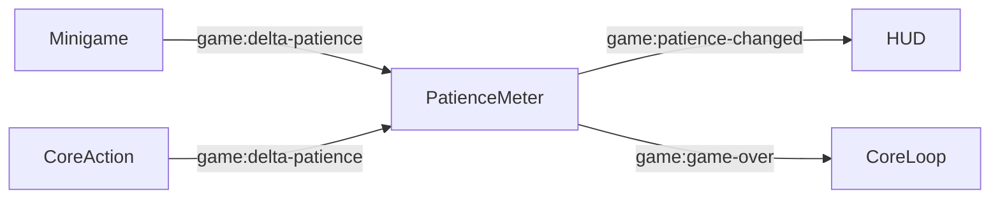

# Design — Paciência da Turma

## Visão geral

O medidor é um componente de domínio do `src/core/patience.ts`. Ele mantém estado em memória e reage a deltas emitidos por eventos do navegador. O `CoreLoop` exibe o valor no HUD e escuta o evento de derrota global.

## Limites

### Esta spec possui

- valor atual da paciência;
- aplicação e normalização de deltas;
- evento de mudança;
- evento de game over.

### Fora desta spec

- regras específicas dos minigames;
- persistência;
- aparência completa do HUD;
- reset por recarga do navegador.

## Arquitetura

O medidor é o dono do valor global. Os produtores enviam apenas deltas e não acessam seu estado interno.

## Contratos

| Evento | Payload | Consumidor |
|---|---|---|
| `game:delta-patience` | `{ detail: { delta: number } }` | `PatienceMeter` |
| `game:patience-changed` | `{ detail: { current: number } }` | HUD/core |
| `game:game-over` | sem payload obrigatório | `CoreLoop` |

## Arquivos

- `src/core/patience.ts` — estado, limites e emissão de eventos.
- `src/core/loop.ts` — inscrição no game over e atualização do HUD.
- `src/core/contract.ts` — contrato dos wrappers de minigame, sem duplicar a lógica do medidor.

## Riscos e revalidação

Alterações nos nomes dos eventos, no payload ou na regra de limite exigem revisar os minigames integrados e executar o build. A condição de game over deve continuar sendo decidida pelo medidor, não por um minigame individual.
