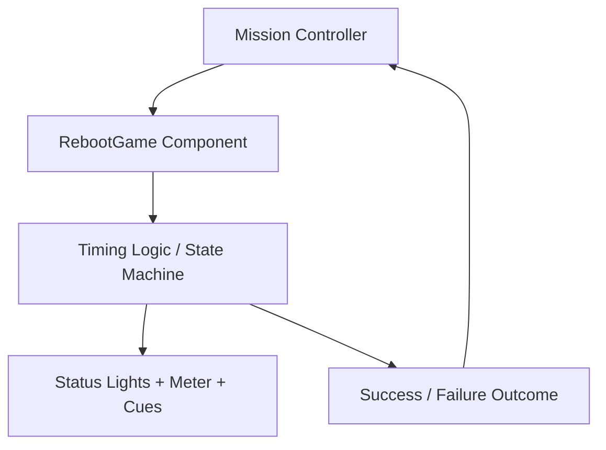
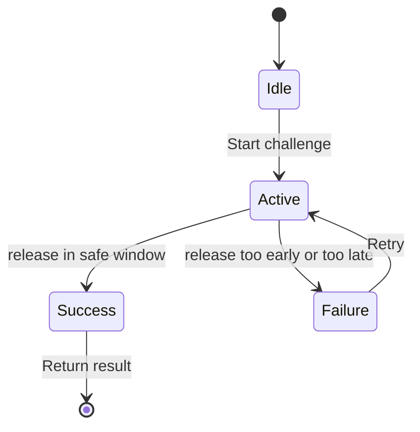

# Design Document

## Overview
The Reboot mini-game is a compact browser challenge designed for the projector support scenario. The player must hold a power button for a precise duration, then release it within a narrow safe window. The design keeps the interaction to one primary action, makes the failure state obvious, and provides immediate recovery so the mission loop stays fun and fast.

### Goals
- Deliver a readable, high-tension power-button challenge in under a minute.
- Ensure a single correct action path with a clear failure and success loop.
- Fit the project’s common minigame contract without coupling to a specific room or classroom state.

### Non-Goals
- No multiplayer or networked state.
- No complex physics or long narrative cutscene.
- No persistent save data beyond the in-session mission result.

## Boundary Commitments

### This Spec Owns
- The reboot timing logic and UI state.
- The challenge animation and feedback cues.
- The outcome payload returned to the parent game flow.
- Retry and restart behavior inside the minigame scene.

### Out of Boundary
- Broader mission progression and ticket generation.
- Backend persistence or server-side validation.
- General project-wide UI patterns beyond the mini-game component.

### Allowed Dependencies
- React component state and CSS for UI.
- Vite, TypeScript/JSX e APIs do navegador já presentes no projeto.

### Revalidation Triggers
- A change to how minigame outcomes are reported.
- Any change in timing or difficulty balancing that alters the expected sequence.
- New accessibility rules or a requirement for a different input method.

## Architecture
This feature is implemented as a self-contained React component with a local finite state machine. The component owns the challenge timing, input events, UI state, and final result. The parent game container only needs to mount the component and respond to the resolved outcome.

### Architecture Pattern & Boundary Map


### Technology Stack
| Layer | Choice / Version | Role in Feature | Notes |
|-------|------------------|-----------------|-------|
| Frontend | React 19 | Component rendering | Browser-based interactive UI |
| UI | CSS / DOM state | Visual timing ritual and feedback | Keeps challenge lightweight |
| State | React state | One mini-game lifecycle | No external store required |
| Runtime | Browser / Vite | Execution environment | Fits existing project setup |

## File Structure Plan
The feature is split between the public wrapper used by the core and the React component used by the interaction.

```text
src/
├── minigames/
│   └── reboot/
│       └── reboot.tsx
├── minigames/react-apps/reboot/
│   ├── RebootGame.jsx
│   ├── RebootGame.css
│   └── rebootConfig.jsx
└── core/loop.ts
```

### Modified Files
- `src/minigames/reboot/reboot.tsx` — adapt the React component to the public core contract.
- `src/minigames/react-apps/reboot/RebootGame.jsx` — implement the challenge logic and UI.
- `src/minigames/react-apps/reboot/RebootGame.css` — style the power button, timing track, and visual warnings.
- `src/minigames/react-apps/reboot/rebootConfig.jsx` — share constants for window timing and difficulty adjustments.

## System Flows


The game does not use a complex event bus. Instead, a single state machine controls transitions between idle, active, success, and failure. This keeps implementation predictable and makes unit testing straightforward.

## Components and Interfaces

### RebootGame
| Field | Detail |
|-------|--------|
| Intent | Manage the hold-and-release power-button challenge |
| Requirements | 1, 2, 3, 4, 5 |
| Owner / Reviewers | Nathan Fuchida |

**Responsibilities & Constraints**
- Start a challenge with a safe window and countdown.
- Track hold duration from the first press.
- Show the timing meter and warning states.
- Return a result payload to the caller after success or failure.

**Dependencies**
- Inbound: Mission parent component — creates the challenge and receives result.
- Outbound: Mission parent component — success or failure payload.
- External: Browser input events and CSS motion preferences.

**Contracts**: State [x] / Service [ ] / API [ ] / Event [ ] / Batch [ ]

##### State Management
- State model: `phase`, `isPressed`, `holdDurationMs`, `safeWindow`, `attemptNumber`, `result`.
- Persistence & consistency: kept in component memory only; no external persistence.
- Concurrency strategy: single-threaded event handling using React state updates.

**Implementation Notes**
- Integration: The component should accept `onComplete` and optional `difficulty` props.
- Validation: Verify early release, late release, and in-window timing states.
- Risks: Timing drift between pointer events and animation frames; mitigate by using `requestAnimationFrame` or a stable timestamp baseline.

## Data Models

```ts
interface RebootConfig {
  targetHoldMs: number;
  safeWindowStartMs: number;
  safeWindowEndMs: number;
  warningThresholdMs: number;
  retryEnabled: boolean;
}

interface RebootResult {
  success: boolean;
  attemptNumber: number;
  holdDurationMs: number;
  reason: 'too-early' | 'too-late' | 'success';
}
```

These structures are enough to model the gameplay loop without requiring persistence or a backend service. They also allow the same component to support difficulty tuning later through configuration injection.
