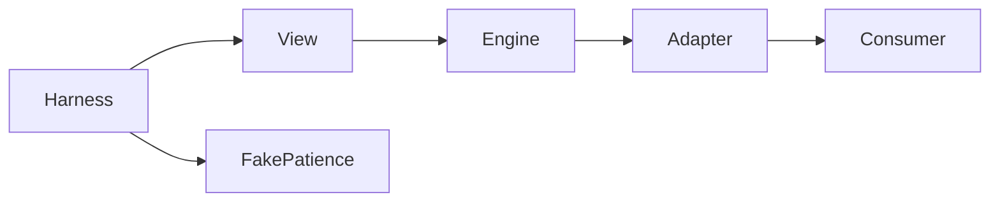

# Design — ROL-03

## Boundary Commitments
O pacote possui somente `.kiro/specs/roleta`, `src/minigames/roleta` e `tests/roleta` dentro da aplicação. Specs seguem a convenção `.kiro/specs` existente. IA-04 pode editar somente `.kiro/steering/tech.md`; persistência tem spec e testes próprios dentro de `src/storage`.

Out of Boundary: lógica e registro dos jogos existentes, App, controller comum, estado global e integração INT-01 de Vitor.

Allowed Dependencies: React já declarado; serviços injetados compatíveis com o contrato local e fixture de Paciência. Nenhum import de outros minigames, core, storage ou telas.

Revalidation Triggers: mudança de nomes/envelope dos eventos, configuração de acessibilidade ou forma de montagem exige reexecutar testes de contrato/harness.

## Arquitetura
Motor determinístico → adapter de eventos → componente React. O motor recebe relógio e timers por injeção opcional; testes usam timers virtuais. O componente contém apenas apresentação e assinatura do estado. Fixture fake acumula deltas para observação no harness, sem implementar o módulo global.

## File Structure Plan
| Caminho na aplicação | Responsabilidade |
|---|---|
| src/minigames/roleta/roulette.js | Configuração validada, seleção, timers, estado e ciclo de vida |
| src/minigames/roleta/contractAdapter.js | Tradução para eventos locais e callbacks do backlog |
| src/minigames/roleta/InputRoulette.js | Controles React e feedback acessível |
| src/minigames/roleta/RouletteHarness.js | Montagem isolada com fixture |
| src/minigames/roleta/fixtures.js | Paciência fake e configuração reproduzível |
| src/minigames/roleta/index.js | Exports públicos |
| src/minigames/roleta/harnessEntry.js | Entrada de build isolado |
| tests/roleta/* | Testes de motor, contrato, interface, configuração Jest e build do harness |

## Interfaces e dados
`createRoulette({ now, setTimer, clearTimer }?)` fornece `start(config, services)`, `select()`, `complete(result)`, `fail(reason)`, `reset()`, `dispose()`, `snapshot()` e `subscribe(listener)`.

Config: `inputs: string[]` única/não vazia, `target` presente, `intervalMs > 0`, `minIntervalMs > 0 <= intervalMs`, `accelerationMs >= 0`, `patiencePenalty <= 0`, `maxErrors` inteiro positivo, `accessibility` com flags booleanas. O estado público é cópia, nunca referência mutável interna.

Estados: idle → running → success/failed; reset retorna a idle e emite reinício; start inicia nova tentativa; dispose fica idle e cancela timers/assinaturas. start repetido cancela tentativa anterior. Comandos de seleção/resultado fora de running não emitem eventos. Aceleração afeta o próximo intervalo integral a partir do erro.

Services: `onEvent(event)`, `complete(result)`, `fail(reason)`, `audio.cue(name)` opcionais. O adapter mantém `{ type, gameId: 'roleta-input', payload, at }` e os nomes observados em `src/minigames/core/events.js`: `minigame:started`, `minigame:succeeded`, `minigame:failed`, `minigame:restarted`, `phase:patience-delta`. O adapter é local e não altera o contrato compartilhado. Não importa arquivos ainda não versionados.

Sucesso: payload com `score`, `durationMs`, `patienceDelta`, `selected`, `errors`, `evidence`. Falha: `reason`, `canRestart: true`, os mesmos dados de auditoria e pontuação zero. Delta de erro: `{ delta, reason: 'wrong-input' }`. O acumulado no resultado é informativo; o consumidor não deve reaplicá-lo. Áudio desabilitado não é chamado; indisponibilidade do áudio não bloqueia o jogo.

O componente aceita `config`, `accessibility`, `onEvent`, `services`; acessibilidade sobrepõe as flags de config. Alterações de configuração reiniciam a tentativa com cleanup; callbacks atuais são usados sem recriar o jogo a cada render do pai. Reiniciar chama reset e start. O harness exibe deltas reais recebidos pela fixture.

## Rastreabilidade e testes
| Requisitos | Componente | Verificação |
|---|---|---|
| 1.1, 1.2, 1.3 | motor e interface | relógio virtual, wrap, acerto e resultado único |
| 2.1, 2.2, 2.3 | motor | erro, limite de velocidade, falha, entradas inválidas |
| 3.1, 3.2, 3.3 | motor, adapter, harness | reset, descarte, eventos compatíveis e delta fake |
| 4.1, 4.2, 4.3 | interface, configuração | teclado, texto/roles, pressão reduzida e ausência de efeitos visuais |

## Integração
Vitor pode importar `InputRoulette` deste pacote no seu registro, mantendo `onEvent` e `accessibility`, ou consumir o motor por `start(config, services)`. A substituição no App/registro é INT-01 e não faz parte deste commit. O harness executável e os testes comprovam o adapter independentemente desse registro.
